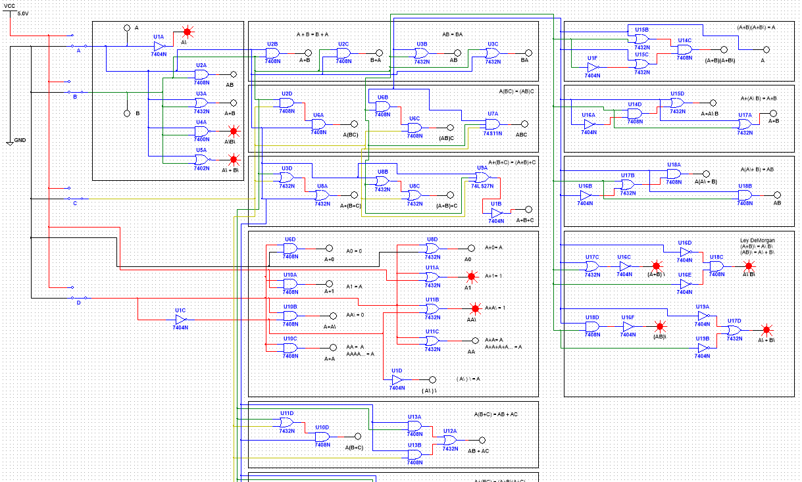

<br />
<div align="center">
	<h3 align="center">Multisim Design</h3>
	<p align="center">
    	NI Multisim project files used to study and design electronic circuits.
  	</p>
</div>

## Installation

1. Buy or download the trial version of [NI Multisim](https://www.ni.com/en-us/support/downloads/software-products/download.multisim.html) (At least version 14.2)
3. Clone the Repo
   ```sh
   git clone https://github.com/DarioArzaba/MultisimCircuitDesign.git
   cd MultisimCircuitDesign
   ```
4. Open, edit and run any of the `ms14` files provided.

</br>
<div align="center"> <p> Example of Logic Gate Equations </p> </div>


## License

Distributed under the [MIT License](https://mit-license.org/).

## Contact

Dario Arzaba - dario.arzaba@gmail.com